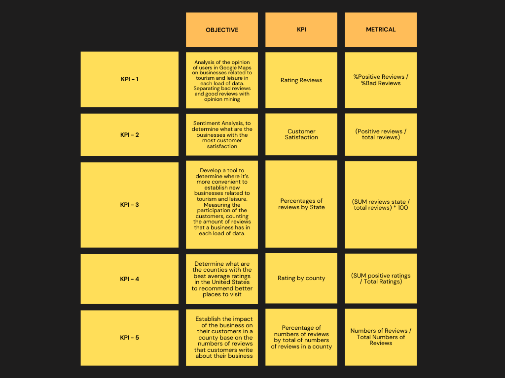

# <h1 align = center> ***Google Maps REVIEWS AND RECOMMENDATIONS***</h1>
# <h2 align=center> **PROYECTO FINAL GRUPAL** </h2>

# <h2 align=center>***Diego Morales Ostos - Mateo Murillo - Camilo Vargas -
 Facundo Gabriel Arce - Oscar Díaz*** </h2>

  

## 1. Introduction

There are platforms such as google reviews, that is incorporated into google maps, where people can give their opinions about businesses in multiple areas. Today these tools are of vital importance for companies, which are able to gather information about their customers perspective to improve performance, analyze local utilities, find faults, and carry out other studies that allow made important decisions for the business.

In this project, based on data obtained from google maps, we seek to develop solutions for a conglomerate of restaurant companies and related businesses in the United States. The solutions will be oriented both to facilitate a better analysis of the reviews, and of growing business areas, as well as to the creation of  tools for make recommendations for users, and for advice on the creation of new stores taking into account the tourist market.

To put these objectives into practice, multiple technological tools will be used for storage, acces and management of data, as well as for the creation of graphs and other analysis tools.

## 2. Problem Statement

A conglomerate of restaurants and companies in the United States wants to take advantage of the information collected by Google Maps on customer ratings and reviews to improve its business plan. for this purpose, the conglomerate requests that solutions be provided to the next points: obtain a detailed analysis of the available reviews of businesses related to tourism and gastronomy, which will allow them to improve their premises to obtain better public acceptance. It is also requested to predict which are the lines of business in which there will be an increase in demand, as well as in which sectors it would be convenient to create new stores. Finally, a tool is also requested that offers a recommendation service to users, introducing them to new restaurants.

## 3. Objectives

- Detailed analysis of the opinion of users in Google Maps on businesses related to tourism and leisure.

- Sentiment analysis, to predict which will be the business items that will grow (or decline) the most.

- Create a tool that allows predicting whether or not a business will show growth, according to its characteristics and those of the environment. In order to know which lines of business will grow or decline.

- Develop a tool, such as a recommendation system, to give the user the possibility of knowing more restaurants options according to their history (previous experiences).

## 4. Approaches
- This project will be focused on the turism market based on the gastronomy, entertaiment and cultural experiences. According to 'Share America', 'ThoughtCo' and 'Vivaturist'; turism's blogs and websites, since 2019 the principal turistic states and cities in the United States are: New York State(New York City-Brooklyn),Florida(Orlando-Miami) and California(Los Angeles - San Francisco). On the side we can also find Arizona, Nevada(Las Vegas), Washignton DC, Masachusets(Boston), Texas(Houston) and Kansas City (Misuri). According to the aforementioned, We are going to focus on the states and counties with the objective of having information groups with better aggregates of places that can accomplish the exposed conditions for those.

- In order to do that We'r going to stablish the following KPI's and Objetives:

## 5. Work Methodology

- As a group we decided to go with the SCRUM work method for a better organization in the activities to do. It is designed to break the whole work into individuals time periods with their own goal, also called 'SPRINTS'. Everyday we would gather in daily meetings that would help us asking our mentor about certain doubts we might have about the assignment.
In our case, these Sprints will have a one week duration each with a presentation of a demo to the Product Owner at the end of every week on fridays.

- For further organization we decided to create a Trello Organization Dashboard that would separate the tasks that we have to do with the ones that are already finished; and we also created a Gantt Diagram that shows the weekly division with the project's SPRINTS full cycle. It is expected for all the participants to use the diagram in order to complete the project's tasks in the rigth order and avoid losing time.
Here there is the diagram.

## 6. Technology stack

 + Python (Numpy, Pandas, Matplotlib, Spicy, Selenium, BeatifulSoup4, Seaborn)
 + Machine Learning (Scikit learn)
 + BigQuery 
 + Streamlit
 + Power BI
 + Google Cloud Platform
 + Github
 + Trello
 + Discord
 
 
 ## 7. ETL

### 7.1 Data transformations
In order to prepare the data according to the needs established in the project, the following transformations were performed.

#### 7.1.1 Data from 'Metadata-sitios'
##### - Filter by category
Since the project is focused on businesses in the hotel and gastronomy sectors, a filter was performed using the 'category' column in the metadata table, to obtain the businesses corresponding to these sectors. To facilitate the requests, a new column 'isHotel' was also added to indicate which of the two sectors each business belongs to.

##### - Hours transformation
It was decided to transform the metadata hours column into a separate table whose columns are the days of the week, and contain the business opening hours, since several businesses have the same hours, this table maintains a one-to-many relationship. with the metadata table, both tables sharing a column 'id_hours'

##### - Misc transformation
Similar to the treatment given to hours, the misc column was also used to generate a new normalized table, with the features and services offered by each business.

##### - Location table
the latitude and longitude columns in the metadata table were used to obtain the address, county, and state of each business. This information is saved in a new table called 'location'

##### - Dropped columns
Considering that they do not provide relevant information for the objectives of the project, it was decided to eliminate the columns 'price', 'state', 'relative_results' and 'url'

#### 7.1.2 Data from 'Reviews-estados'

##### - Filter rows
Having already filtered the metadata table to keep only the hotel and gastronomy businesses, the 'gmap_id' list of the chosen businesses was used to filter the reviews corresponding to them.

##### - Time transformation
since the time column was encoded in Unix time format, it was transformed and saved in a date format.

##### - State column
As that initially the data from reviews was segmented into several folders according to the state to which they belong, a new 'state' column was added to be able to keep this information once the data was united in a single table

##### - Dropped columns
Considering that they do not provide relevant information for the objectives of the project, it was decided to eliminate the columns 'name', 'pics', 'resp'

### 7.2 Enhanced Entity-Relationship (EER) diagram
Below is an EER diagram where you can see the final tables that were obtained after the transformation, including their relationships and columns, as well as the data type of the latter.

 
### 7.3 Data warehouse
The BigQuery service provided by Google Cloud was chosen to set up the data warehouse. Bigquery is compatible with the SQL language, and is designed to query large volumes of data, at high speed, a very important factor for this project where millions of data distributed in multiple tables are handled, which need to be consulted frequently during the process of development of APIs and maching learning models.
The transformed data was uploaded and stored in google storage, to be later imported into bigquery, where a dataset called maps_reviews had previously been created. For the creation of the tables, the automatic detection of the schema offered by bigquery itself was used, and it worked without presenting major problems.

 ## Team Members and their Roles

 + Camilo Vargas - Data Engineer
 + Mateo Murillo - Data Engineer
 + Oscar Sánchez - Data Scientist
 + Facundo Gabriel Arce - Data Scientist
 + Diego Morales - Data Analyst
 
 
